# TheInfluenceOfRecordingAndRestorationConditionsOnGeometricDistortionsOfAHolographicImage
***Содержание задания:*** 

Определить координаты вершин плоского объекта – треугольника ABC, наблюдаемого в действительном и мнимом изображении, восстановленном с внеосевой голограммы.

Результаты расчёта представить на чертеже.

Сравнить объект и его изображение.

Определить поперечное увеличение и площади фигур.

***Исходные данные к расчёту:***

1. Координаты объекта (в мм):

   т. А (-50; -50;-750), т. В (-50 ;100; -750), т. С (100; -50; -750);

1. Координаты источника опорной волны (в мм):

   XR = 0, YR = -1000, ZR = 1000;

1. Координаты источника восстанавливающей волны (в мм):

   XC = 0, YC = -500, ZC = 1000;

1. Длина волны: λ1 = 0,48 мкм; λ2 = 0,64 мкм.

***Рабочие формулы:***

Координаты изображения 1

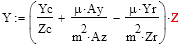

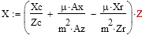

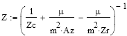

Координаты изображения 2

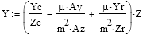

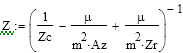

Поперечное увеличение для изображения 1:

Поперечное увеличение для изображения 2:

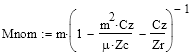

Площадь треугольника:

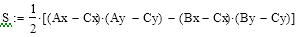

Коэффициент увеличения длины волны:

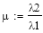

***Расчеты:***

Считаем, что линейное увеличение m = 1.

Коэффициент увеличения:

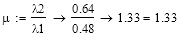

Вычислим координаты 1-го изображения для каждой точки.

Для т.А:

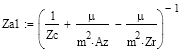= -475.44

= -42.16

= -436.77

Для т.В:

= -475.44

= -42.16

= -310.30

Для т.С:

= -475.44

= 84.31

= -436.77

Вычислим координаты для 2-го изображения для каждой точки (мм).

Для т.А:

= 243.70

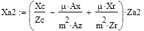= -21.61

= -467.58

Для т.В:

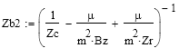= 243.70

= -21.61

= -402.75

Для т.С:

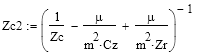= 243.70

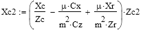= 43.22

= -467.58

Найдем поперечное увеличение для изображения 1:

= 0.84

Найдем поперечное увеличение для изображения 2:

= 0.43

Площадь исходной фигуры:

AC=150 мм, BC=212.13 мм AB=150 мм

S=11250 (мм2)

Площадь изображения 1:

AICI=126.47мм, BICI=178.86мм AIBI=126.47мм

SI=7997.33(мм2)

Площадь изображения 2:

A2C2=64.83 мм, B2C2=91.68 мм A2B2=64.83 мм

S2=2101.46(мм2)

Проверим расчеты: 

S1S=7997.3311250=0.711   Mnom12=0.842=0.706

S2S=2101.4611250=0.187  Mnom22=0.432=0.184

Треугольник A1B1C1 (изображение 1), треугольник ABC (исходный), Треугольник A2B2C2 (изображение 2) на плоскости OxOy:

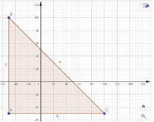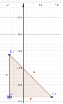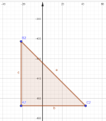

Треугольники ABC, A1B1C1 и  A2B2C2 относительно друг друга на плоскости OzOy:

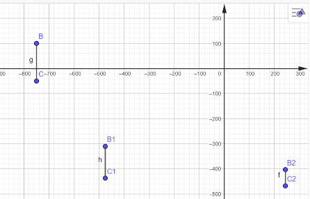

***Вывод:***

Определив вершины треугольника АВС, наблюдаемого в действительном и  мнимом изображении, восстановленном с внеосевой голограммы, построили их изображения на плоскости ОхОу и OzOy. В сравнение с объектом, изображение А1В1С1 является уменьшенным (Mnon1=0.84) с площадью S1=7997.33 мм2 и мнимым(об этом свидетельствует положение треугольника относительно объекта, а именно координата по оси Oz: -475.44), а изображение А2В2С2 является уменьшенным (Mnon2=0.43) c площадью S2= 2101.46 мм2, но действительным (так как координата по Oz положительна и равна 243.70).

